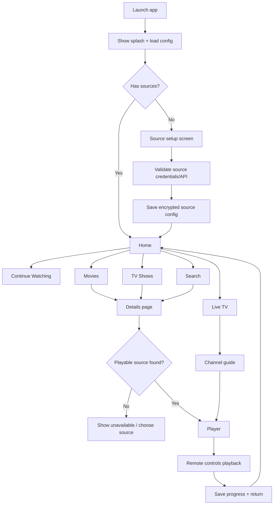

# VIDAA TV Streaming App Plan

## Goal
Build a clean, minimal, Apple TV-inspired VIDAA app that feels native on Hisense/Toshiba/VIDAA TVs, supports remote-button navigation, loads fast on low-memory TV hardware, and can expand across VIDAA software versions.

> Legal/product boundary: the app should aggregate only content and metadata from sources we are authorized to use. Do not scrape or redistribute copyrighted streams from third-party sites such as Cineby-style indexes unless there is explicit permission. Use official metadata APIs and authorized stream/provider APIs.

## Research summary

### VIDAA platform direction
- VIDAA apps are generally HTML5/web-app based, with store distribution requiring a VIDAA developer/partner account and access to SDK/certificate tooling. Muvi's VIDAA publishing guide describes the need for a VIDAA developer account, SDKs, certificate tools, and developer console access: https://help.muvi.com/help/how-to-create-and-publish-your-vidaa-app
- VIDAA OS is Linux-based and optimized for TV simplicity/performance, so the app should be a lean TV web app rather than a heavy SPA: https://spyro-soft.com/blog/media-and-entertainment/what-is-vidaa-os-a-comprehensive-guide-to-your-smart-tv-experience
- VIDAA markets a large app-store/content ecosystem and long device support window, so compatibility testing needs to cover old and current devices, not only one TV: https://www.vidaa.com/
- HbbTV/TV-style web apps rely on remote-control key events and focusable UI. HbbTV guidance is useful for directional navigation, safe-area thinking, and remote input behavior: https://developer.hbbtv.org/guide/getting-started/interaction-with-the-remote-control/
- A public VIDAA web-app guide is referenced online but the canonical SDK/docs should be obtained from the VIDAA developer portal before implementation: https://www.scribd.com/document/825727528/WebApp-Development-Guide-for-VIDAA

### Player direction
- Prefer the TV's native HTML5 video pipeline first, because hardware decoding is usually smoother and lower power than custom JavaScript buffering.
- Add a thin player adapter layer so the app can choose the best engine per device:
  1. Native `<video>` for MP4/progressive and HLS where supported.
  2. Shaka Player for DASH/HLS via MSE/EME when native support is missing or DRM/adaptive streaming requires it. Shaka is open source and supports DASH/HLS through browser standards: https://github.com/shaka-project/shaka-player
  3. hls.js only as an HLS-specific fallback on devices with working MSE; it implements HLS on top of HTML5 video and MSE: https://github.com/video-dev/hls.js/
- The player must expose a remote-first command API: play/pause, seek back/forward, stop/back, info/quality, subtitle/audio track selection, and resume position.
- Keep buffering low with adaptive streams, CDN-friendly URLs, correct segment duration, preflight stream validation, and fast failure fallback to alternate source links.

### Metadata/catalog direction
- Use TMDB for movie/TV metadata and artwork rather than scraping UI sites. TMDB image URLs are built from a base URL, file size, and file path: https://developer.themoviedb.org/docs/image-basics
- Use TMDB movie/TV image APIs for posters/backdrops/logos: https://developer.themoviedb.org/reference/movie-images
- For live TV/IPTV, support authorized Xtream Codes-style inputs: base URL, username, password, display name. Providers commonly expose live categories, VOD, series, and sometimes EPG/replay data. The app should normalize that into one catalog.
- Keep a configurable source registry where the owner can add providers/websites/APIs, but enforce a connector contract and compliance review before enabling public use.

### UI inspiration
- Visual style: Apple TV-like dark cinematic background, large posters, simple typography, high-contrast focus rings, blur/glass only where performance allows.
- Use a lightweight “liquid glass” substitute: translucent panels with subtle borders and pre-rendered/low-cost gradients. Avoid expensive real-time backdrop-filter blur on older VIDAA models.
- Use skeleton placeholders, poster shimmer, and row-level loading states so the UI never appears frozen.
- Build for 10-foot viewing: large type, large focus targets, generous spacing, safe-area margins, no mouse-dependent interactions.

## Product scope

### Phase 1: VIDAA app foundation for the owner’s TV
- Create a new dedicated Git repo for the VIDAA app when coding starts.
- Confirm target TV model, VIDAA OS version, user agent, supported codecs, MSE/EME support, native HLS behavior, storage quotas, and remote key codes.
- Build a lightweight HTML5 TV shell with remote navigation, app routing, source configuration, catalog browsing, details pages, search, and playback.
- Implement player adapter with native video first and Shaka/hls.js fallbacks.
- Add a backend/API proxy only where needed for source normalization, CORS, secrets, caching, and compliance.

### Phase 2: Catalog aggregation
- Source types:
  - TMDB metadata provider for posters, titles, summaries, genres, cast, release dates, ratings.
  - Authorized streaming-source connectors configured by the owner.
  - Xtream Codes connector for live TV, movies, series, categories, and EPG when provided.
- Normalize all content into shared entities: `Movie`, `Series`, `Episode`, `Channel`, `LiveProgram`, `PlaybackSource`, `Artwork`, `Provider`.
- Cache aggressively on hosting/backend: metadata, posters, categories, and provider catalog snapshots.

### Phase 3: Compatibility and store readiness
- Test across VIDAA OS versions and device classes.
- Prepare store assets, privacy policy, terms, support URL, remote-control behavior documentation, and content-rights documentation.
- Add automated performance budgets and a manual TV QA checklist.

## User experience flowchart



## Screen sketches

### 1. Home

```text
┌──────────────────────────────────────────────────────────────┐
│  AppName                                      Search  Settings│
│                                                              │
│  ┌──────────────── Featured hero / backdrop ───────────────┐ │
│  │ Title, short metadata, Play button, More Info            │ │
│  └──────────────────────────────────────────────────────────┘ │
│                                                              │
│  Continue Watching                                          │
│  [ poster ] [ poster ] [ poster ] [ poster ] [ poster ]     │
│                                                              │
│  Trending Movies                                            │
│  [ poster ] [ poster ] [ poster ] [ poster ] [ poster ]     │
│                                                              │
│  Live TV                                                    │
│  [ channel ] [ channel ] [ channel ] [ channel ]            │
└──────────────────────────────────────────────────────────────┘
```

### 2. Details

```text
┌──────────────────────────────────────────────────────────────┐
│ Back                                                         │
│   [ Poster ]   Title                                        │
│              Year • Runtime • Genre • Rating                │
│              Short overview text in 2-3 lines max           │
│              [ Play ] [ Trailer ] [ Add to List ]           │
│                                                              │
│              Available Sources                              │
│              Provider A  1080p  HLS                         │
│              Provider B  720p   MP4                         │
│                                                              │
│   Cast / Similar / Seasons                                  │
└──────────────────────────────────────────────────────────────┘
```

### 3. Player overlay

```text
┌──────────────────────────────────────────────────────────────┐
│                                                              │
│                         VIDEO                                │
│                                                              │
│  ┌──────────────── translucent control overlay ───────────┐  │
│  │ Title                                                    │ │
│  │ 00:14:10 ━━━━━━━━━━━━━━━●──────────── 01:42:00          │ │
│  │ [RW] [Play/Pause] [FF] [Audio] [Subtitles] [Quality]    │ │
│  └─────────────────────────────────────────────────────────┘  │
└──────────────────────────────────────────────────────────────┘
```

### 4. Live TV

```text
┌──────────────────────────────────────────────────────────────┐
│ Live TV                                      Filter/Search    │
│ ┌──────────────┐ ┌─────────────────────────────────────────┐ │
│ │ Categories   │ │  Channel  Current Program      Next     │ │
│ │ All          │ │  BBC      News                 Sports   │ │
│ │ Sports       │ │  ESPN     Match                Talk     │ │
│ │ Movies       │ │  ...                                      │ │
│ └──────────────┘ └─────────────────────────────────────────┘ │
└──────────────────────────────────────────────────────────────┘
```

## Remote-control behavior

| Button | Browsing behavior | Playback behavior |
| --- | --- | --- |
| Up/Down/Left/Right | Move focus between rows/cards/buttons | Show overlay, seek/controls navigation |
| OK/Enter | Open selected item / activate button | Toggle focused control |
| Back/Return | Go back one screen; exit prompt on root | Hide overlay, then return to details/home |
| Play/Pause | Play selected/resume item when focused | Toggle play/pause |
| Rewind | Move carousel left or page back | Seek -10s / long press faster |
| Fast Forward | Move carousel right or page forward | Seek +10s / long press faster |
| Stop | No-op or return to details | Stop playback and save progress |
| Info | Open item details | Show stream info/debug overlay |

Implementation notes:
- Build a deterministic spatial-navigation system; do not depend on browser tab order.
- Store last-focused card per row and restore focus after back navigation.
- Handle long key presses with throttling to avoid runaway focus movement.
- Build a device key-code map discovered from the actual TV and allow overrides.

## Performance principles

- Initial JavaScript target: under 250 KB gzipped for app shell, with player libraries lazy-loaded only when playback starts.
- Use CSS transforms and opacity for animation; avoid layout-thrashing animations.
- Use virtualized horizontal rows; render only visible cards plus a small buffer.
- Use responsive image sizes and WebP/AVIF only after device support detection.
- Preload the hero image and first row; lazy-load the rest.
- Cache metadata and poster URLs with stale-while-revalidate behavior.
- Avoid heavy backdrop blur on older devices; use static gradients/translucent panels.
- Use skeleton cards and row-level placeholders during fetches.
- Keep all remote actions under 100 ms perceived response.

## Proposed architecture

```text
VIDAA HTML5 App
├─ App shell/router
├─ Remote input + spatial navigation
├─ UI components
│  ├─ Home rows
│  ├─ Details
│  ├─ Search
│  ├─ Live guide
│  └─ Player overlay
├─ Catalog domain layer
│  ├─ TMDB metadata adapter
│  ├─ Xtream adapter
│  ├─ Custom source adapter contract
│  └─ Normalized catalog cache
├─ Player domain layer
│  ├─ NativeVideoAdapter
│  ├─ ShakaAdapter
│  └─ HlsJsAdapter
└─ Device capability layer
   ├─ VIDAA version/user-agent detection
   ├─ Codec/MSE/EME tests
   ├─ Key-code mapping
   └─ Storage/network diagnostics

Hosted Backend / API Proxy
├─ Provider credential storage
├─ Catalog normalization jobs
├─ Metadata cache
├─ Image proxy/resizer if needed
├─ Stream URL resolver/health checker
└─ Compliance/source allowlist
```

## Data model draft

```ts
type Provider = {
  id: string;
  type: 'tmdb' | 'xtream' | 'custom';
  name: string;
  baseUrl?: string;
  enabled: boolean;
};

type CatalogItem = {
  id: string;
  kind: 'movie' | 'series' | 'episode' | 'channel';
  title: string;
  subtitle?: string;
  overview?: string;
  posterUrl?: string;
  backdropUrl?: string;
  year?: number;
  genres: string[];
  providerIds: string[];
};

type PlaybackSource = {
  id: string;
  catalogItemId: string;
  providerId: string;
  url: string;
  format: 'hls' | 'dash' | 'mp4' | 'unknown';
  quality?: 'auto' | '4k' | '1080p' | '720p' | 'sd';
  requiresProxy?: boolean;
};
```

## Roadmap

### Milestone 0: Requirements and device discovery
- Identify exact VIDAA TV model and software version.
- Register/request VIDAA developer access.
- Capture user agent, remote key codes, codec support, MSE/EME support, HLS support, and storage limits.
- Decide legal/authorized source list.

### Milestone 1: Prototype app shell
- Create dedicated VIDAA app Git repo.
- Implement app shell, routing, focus engine, remote key logger, mock catalog, and Apple TV-like UI theme.
- Measure launch time, focus latency, memory behavior.

### Milestone 2: Catalog and source setup
- Add source setup screen.
- Add TMDB metadata connector.
- Add Xtream connector for authorized live/VOD/series catalogs.
- Add normalized catalog cache and search.

### Milestone 3: Playback
- Implement native player adapter.
- Add Shaka/hls.js fallback strategy.
- Add playback overlay, subtitles/audio/quality controls, resume position, error recovery.
- Add stream health checks and alternate source fallback.

### Milestone 4: Polish and compatibility
- Add skeleton loading, poster caching, row virtualization, offline/error states.
- Tune animations per device capability.
- Test on current target TV, then older/newer VIDAA versions.

### Milestone 5: Store/package readiness
- Prepare VIDAA package/assets, privacy policy, terms, support docs, QA checklist.
- Validate content rights and provider terms.
- Submit/test through VIDAA developer flow.

## Open questions before coding

1. What is the exact TV model and VIDAA OS/software version?
2. Do you already have VIDAA developer portal access?
3. Which content sources are authorized, and which are only metadata/reference sites?
4. Do you want login profiles/watchlists, or single-user local preferences first?
5. Should provider credentials live only on your hosted backend, or also locally on the TV for direct access?
6. Do you need DRM support, or only non-DRM HLS/DASH/MP4 streams from authorized providers?
